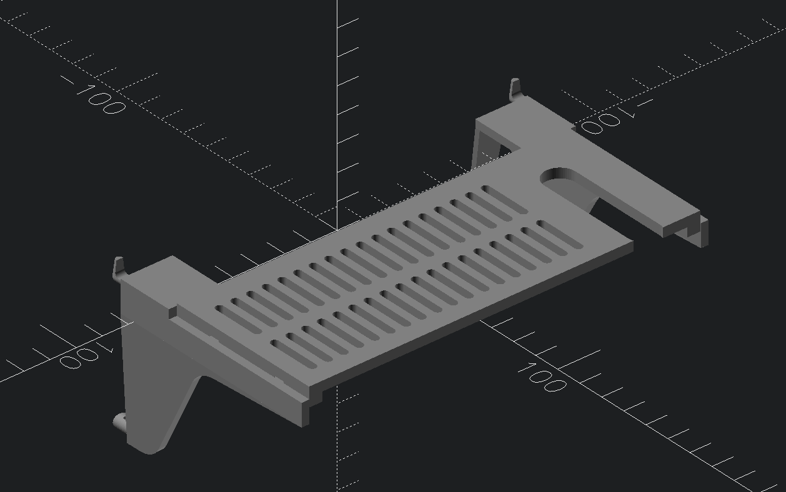

# Primex/Leviton Structured Media Cabinet Hardware

This print is for both mounting brackets and a shelf to mount hardware inside a
Primex SOHO in-wall Structured Media Cabinet. It's extremely similar to
Leviton's design, but just different enough that the many Leviton designs on
Printables do not fit.

These should in theory fit any Primex Structured Mounting System (SMS)
compatible cabinet, but I have only tested with the SOHO 3000.

The included shelf fits a Netgear GS305 series switch, the pictured switch is a
GS305EPP, along with its power supply. Both fit nicely on the shelf, and the
door will close. There are holes in the shelf to run barrel jacks and cables
through, and rungs to run zipties or Velcro straps through for easy mounting of
generic hardware to the shelves.
